# 一个黑客能用一台手机做到什么事情？

泻药，文章不短，相对硬核，图片很多，流量党慎入（先来波逼乎文化，手动滑稽）  
  

情怀相关：  
和某高票一个观点类似——“基本上电脑能完成的手机大致都可以做到”  

但是手机却又有自己的一些优点，即：便携

这便是一些中二的黑客们从手机发起攻击的重要原因（艾登皮尔斯：？？？）

《看门狗2》里黑客Marcus见到自己偶像T-bone讲到：  

>我看着你曾经”战争驾驶“，并因此改装了我的十段变速脚踏车，然后在背包上加装天线

<b>战争驾驶（WarDriving）</b>就是指使用相应的硬件和软件打造的无线局域网侦察平台，通过徒步或利用相应交通工具的方式在各个城镇的每个街道寻找不设防的无线访问点(AP)的一种统称。

而它的存在，便是黑客对”便携性“这个需求的最大证明

和另一高票经历很相似，我初高中对安全感兴趣，却奈何家里不让随意使用电脑，自然打起了“从手机入手学安全”的心思，这么些年也折腾过不少安全相关APP，在这里大致汇总了下  

<b>并从软件、工具角度出发，带你了解黑客能用一部手机做些什么。</b>  

下面是正文：
先讲讲和黑客直接相关的

## 0x00.针对不乐意折腾的人
### 终端与连接类  
* JuiceSSH  

* ConnectBot  

* 终端模拟器  

* Termux  

* VNC Viewer  
 
### 编程类  
* Qpython 3/OL（python安卓端编程app，挺多版本，看需求）  

* C4droid  （安卓端编写C语言的app）

* AIDE Web  （编写web相关语言）

### 各种厂商路由器、服务器app  
* TP-LINK  

* 天翼网关、天翼云电脑（放在这里说，因为前段时间在天翼云白嫖服务器实在太香了）

* ...

### 其余类  
* ES文件浏览器  （没root的首选，现在广告有点烦人，不过也吊打那些手机自带的）  

* IP Tools   （一款个人比较喜欢的查局域网ip信息相关工具）  

* Tasker  （一款让你手机自动化起来的软件，用得好是神器，不过得花精力学习用法）  

* Packet Capture  （经典手机抓包软件，不会在电脑上搞burp代理的话还是蛮方便的）  

* Github/Openhub/Coding  （各种代码托管网站的手机版app）

## 0x01.针对乐意折腾的人
说实话，“黑客精神”怎会嫌麻烦，不折腾的话很多吊炸天的功能你是开发不出来的  
这里的折腾特指：搞Root、刷机、adb操作，熬夜（滑稽）...

### 一般软件类
* Shadowsocks/Shadowsocks R、各种VPN （科学上网，不多比比）  

* cSploit/dSploit  （贼牛逼的一个局域网攻击神器）

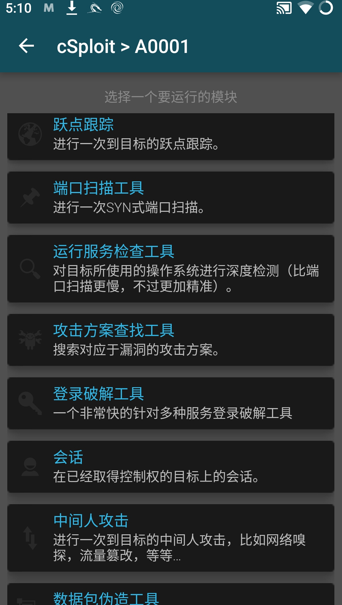

* zANTI  （同上，但是听说动静较大，所以我基本还是用上面那个）

* MT管理器、Root Explorer  （个人用RE较多，文件管理神器，吊打ES）  

* Shodan  （强大的联网设备搜索引擎，其功能参照：Zoomeye、Fofa等）

* Hacker's Keyboard  （如果不外接键盘，这个键盘软件绝对是我的心水，因为它优化了界面，更容易输入那些搞安全需要用到的字符）  

* RF Analyzer （Nethuner自带，无线射频分析相关，我没怎么用过，毕竟360的Hackcube啥的都有自家的软件。。。）

* Nethunter VNC  （Nethunter自带，不过我的版本老报错，所以自己还是使用 VNC Viewer较多）

* Tor  （首先需要科学上网，然后你便可以通过这个全球代理软件隐蔽的进入暗网了）

  

* 其他某些软件自我感觉蛮花里胡哨，实际渗透中其实比较局限，我平常不太用，这里放下  

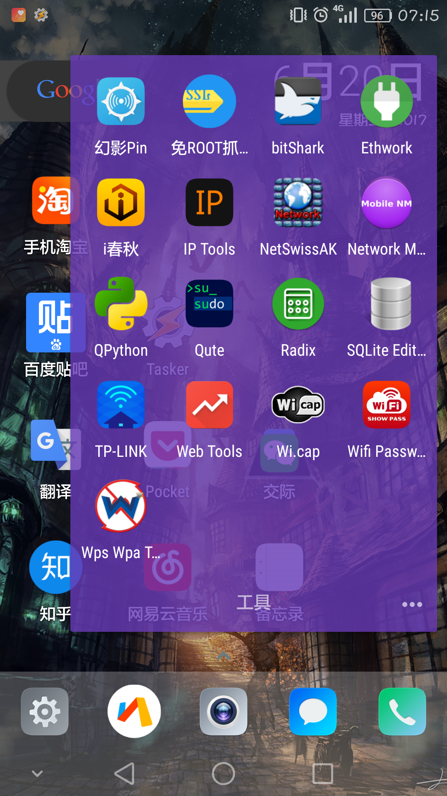

### （重头戏）框架类
* 首先祭上最牛逼的Kali Nethunter ！！！

做黑客不知道kali怎么行，有句老话：kali学得好，牢饭吃得早（大雾）

首先，你可以在终端使用绝大部分kali软件，如下：  

Metasploit  （经典漏洞利用框架，是你从手机向世界发起攻击的不二选择（笑））

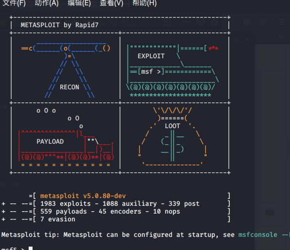

Nmap  （老牌扫描器，现在仍是一把好手）  

Sqlmap  （数据库注入神器）  

ettercap  （局域网ARP欺骗工具）

wifite  （经典无线攻击工具，爆破wifi密码等）

kali上工具太多了，用过的自然知道手机版的kali有多imba，唯一的硬伤就是“手机的处理速度”，不过瑕不掩瑜

* Nethuner （Kali Nethunter自家系统集成的软件，功能丰富）

MAC Changer（更改对外显示的设备MAC地址）

DuckHunter HID  （将自己的手机模拟为一个badusb，通过数据线插入设备即可造成危害）

Pineapple Connector  （Wifi Pineapple连接器，相当于简化了从浏览器直连，如果买的是某宝的国产大菠萝刚好能用上，如果买的是官方菠萝派，建议使用google play上人家自家的软件）

DeAuth  （流量洪水攻击）

* AndRax  （当初Freebuff一推送，我就直接去官网下载了初版，不过个人用的不多）  

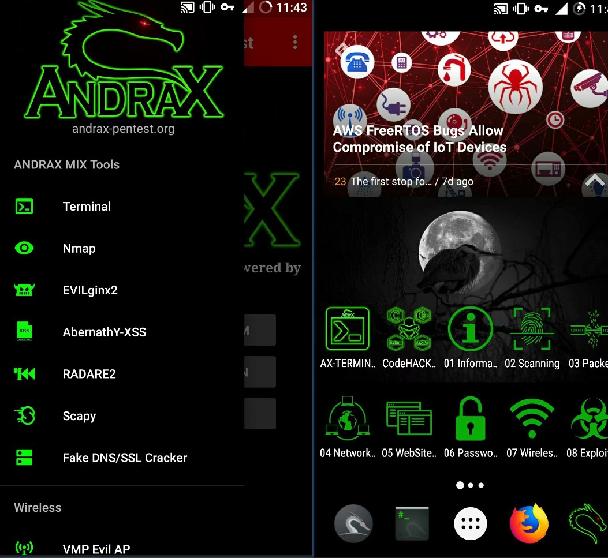

* Xposed框架  （这个必须要提，很多玩机的发烧友很喜欢在这个上面做文章，酷安上有一大堆模块），比方说我们可以：  
  * qq/微信秒抢红包    

  * 手机状态栏等各种奇妙美化

  * 更牛逼的杀后台应用

  * 这是一个玩机的深坑.......

**********
我是萌萌哒的分割线
**********

## 0x02.外挂相关
虽说不只是单单一部手机了，但是在这里介绍一些以手机作为主体而向外扩展的外挂

* 分线器、转接线  （必备，自供电那种最好，手机的一个插线口过于限制我们黑客的想象力（笑））

* TP-LINK TL-WN722N  （适配kali的无线网卡，如果你要使用wifite，这个必备）  

* Wifi Pineapple  （wifi大菠萝，一个词描述就是“牛逼”，想要图形页面直接在手机浏览器输入ip就可访问，如果钟爱命令行，不妨尝试：“JuiceSSH+大菠萝”）  

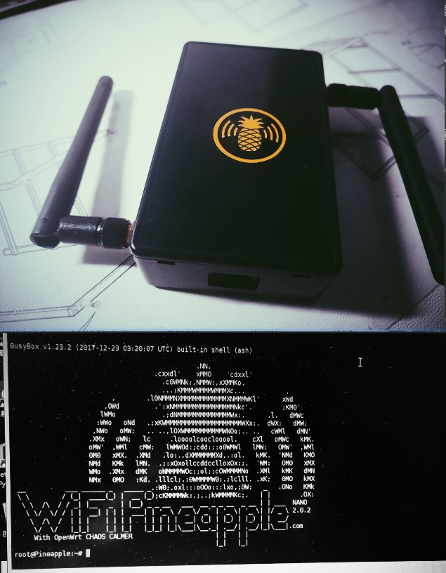

* 无线键盘  （手机屏幕键盘始终还是不方便，用钱就买蓝牙的（罗技那款，100+），没钱就在某宝买飞鼠键盘（30-40rmb））  

* 其他工具，与手机联合打组合拳（要不是在手机上ssh，有线连接，要不就是官方有手机版app）

树莓派  （不多说了，用手机ssh连上能做的事情太多）  

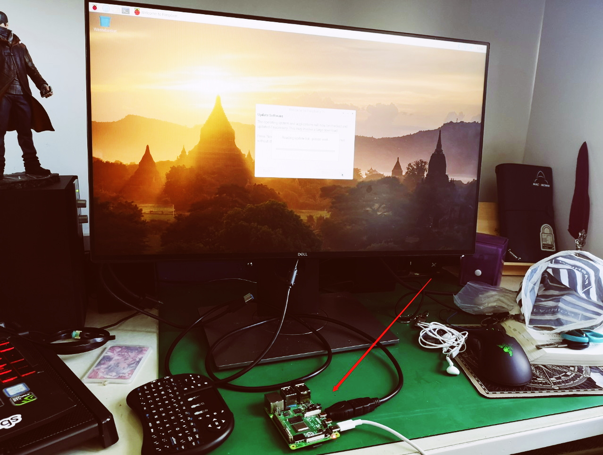

Proxmark3/4 （基于RFID的嗅探、克隆等操作，可用于破解ID/UID等卡片）  

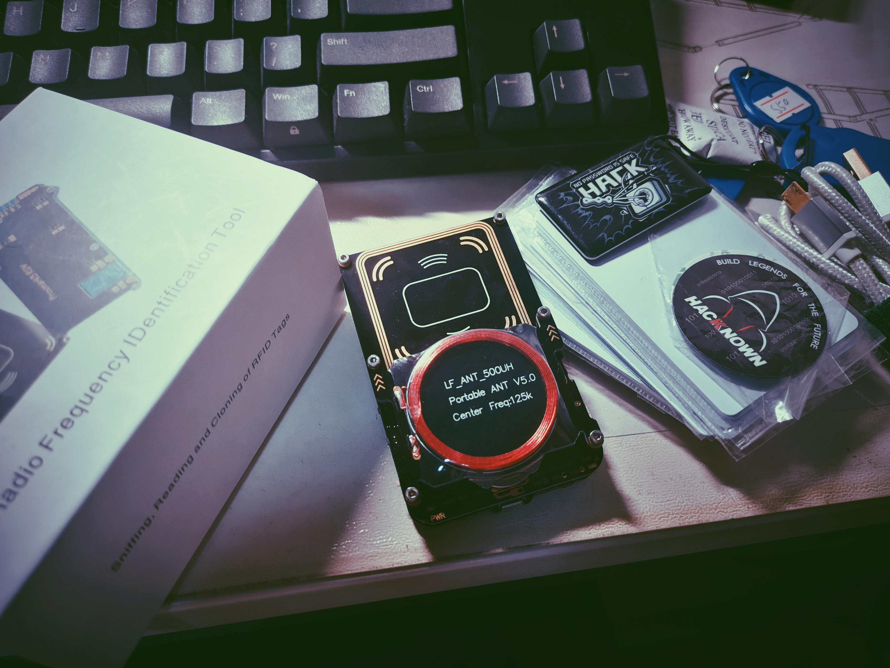

PocketChip  （一个我自己比较喜欢的Linux小玩具）  

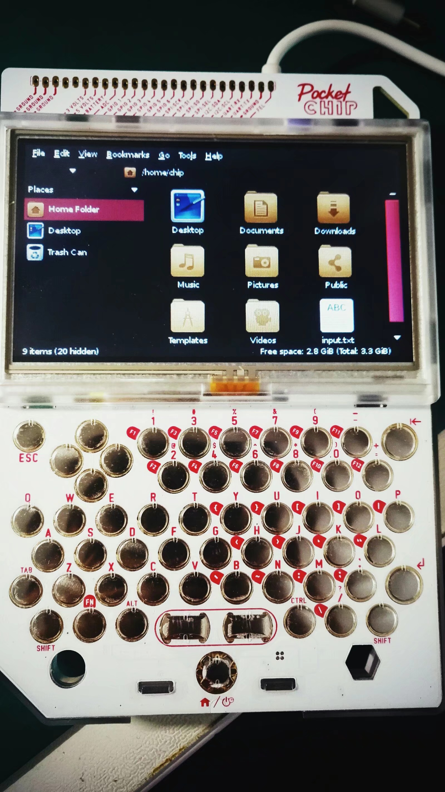

Hackcube  （360无线电研究院搞的便携式硬件平台）  

Badusb/USB Ninja  （或者圈内小火龙大佬自己搞得hackusb） 
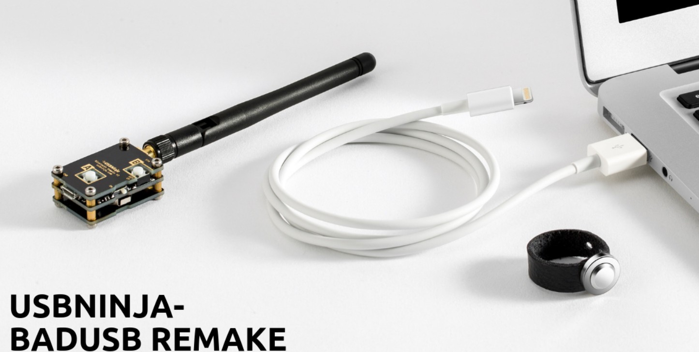 

**********
我是萌萌哒的分割线
**********

## 0x03.黑客情怀相关  
“黑客也是寻常人”（笑），以下罗列一些其他搞安全必知必备的软件

### 通过手机获取安全资讯
* Telegram  （即“电报”，除了些奇奇怪怪的channel（逃），有些资源，大佬的博客在这个上面都可以找到，比方说：余弦大佬的“灰袍推送”）

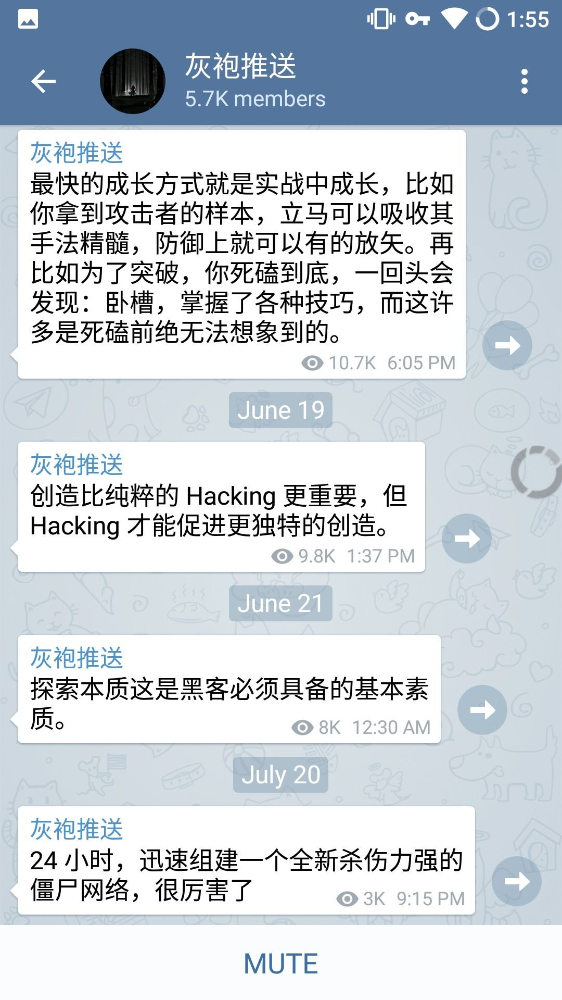

* Twitter  （搞安全，缺不了与国际接轨，很多0day或是国外大牛的好文章都会在这上分享，只是比较考验英语水平）

* Feedly  （如果你受不了短平快的碎片化信息，在Feedly上订阅一些大佬的博客不失为一个好习惯（虽然现在有些功能需要花钱让我很不爽））

* Ins  （如果你喜爱黑客文化，在这个上面你绝对能找到很多非常有创意的黑客文化元素）

### 通过手机看安全视频

* Youtube  （开玩笑呢，Blackhat、Defcon、Hak5各种频道都聚集在此，怎么能少得了这款软件）

* bilibili  （作为新世纪的优秀青年，你应该敏锐的发觉：国内很多安全团队的内部培训视频非常喜欢上传b站，以及b站的直播）

* i春秋  （虽然手机版体验也就那样，不过仍是一个不错的安全学习平台）

最后，放上我的情怀黑莓镇楼：  

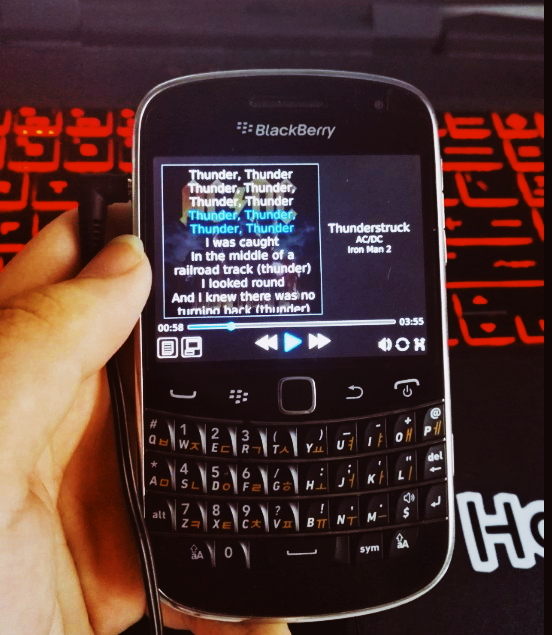

本文由<b>思而听网络科技有限公司</b>-渗透部门：Resek4 原创编写，转载请告知我们  

如果你对网络安全、渗透、黑客感兴趣，欢迎关注~
